Progress report 1
================
Natalie
2019-02-03

``` r
library(tidyverse)
```

    ## ── Attaching packages ──────────────────────────────────────────────────────────────────── tidyverse 1.2.1 ──

    ## ✔ ggplot2 3.1.0     ✔ purrr   0.2.5
    ## ✔ tibble  2.0.1     ✔ dplyr   0.7.8
    ## ✔ tidyr   0.8.2     ✔ stringr 1.3.1
    ## ✔ readr   1.3.1     ✔ forcats 0.3.0

    ## ── Conflicts ─────────────────────────────────────────────────────────────────────── tidyverse_conflicts() ──
    ## ✖ dplyr::filter() masks stats::filter()
    ## ✖ dplyr::lag()    masks stats::lag()

``` r
library(maptools)
```

    ## Loading required package: sp

    ## Checking rgeos availability: TRUE

``` r
library(sf)
```

    ## Linking to GEOS 3.6.1, GDAL 2.1.3, PROJ 4.9.3

``` r
# Import all the data
file_2000_income <- "~/Desktop/DCL/C01/DEC_00_SF3_DP3/DEC_00_SF3_DP3.csv"
file_2000_race <- "~/Desktop/DCL/C01/DEC_00_SF1_QTP3/DEC_00_SF1_QTP3.csv"
file_2017_race <- "~/Desktop/DCL/C01/ACS_17_5YR_DP05/ACS_17_5YR_DP05.csv"
file_2017_income <- "~/Desktop/DCL/C01/ACS_17_5YR_S2503/ACS_17_5YR_S2503.csv"
```

## Work so far…

``` r
# reading in csv's and joining race and income data from 2000

race_2000 <-
  file_2000_race %>% 
  read_csv(
    col_names = TRUE,
    col_types = cols_only(
      GEO.id = col_character(),
      GEO.id2 = col_double(),
      `GEO.display-label` = col_character(),
      HC01_VC02 = col_integer(),
      HC01_VC04 = col_integer(),
      HC01_VC05 = col_integer(),
      HC01_VC06 = col_integer(),
      HC01_VC11 = col_integer(),
      HC01_VC20 = col_integer(),
      HC01_VC26 = col_integer(),
      HC01_VC27 = col_integer(),
      HC01_VC34 = col_integer()
    )
  ) %>% 
  rename(
    full_tract_code = GEO.id,
    county_fips = GEO.id2,
    tract_name = `GEO.display-label`,
    total_pop = HC01_VC02,
    white_pop = HC01_VC04,
    black_pop = HC01_VC05,
    native_pop = HC01_VC06,
    asian_pop = HC01_VC11,
    hawaiian_pacisland_pop = HC01_VC20,
    other_pop = HC01_VC26,
    mixed_pop = HC01_VC27,
    hispanic_latino_total_pop = HC01_VC34
  ) %>% 
  filter(county_fips != 36061)

income_2000 <-
  file_2000_income %>% 
  read_csv(
    col_names = TRUE,
    col_types = cols_only(
      GEO.id2 = col_double(),
      HC01_VC64 = col_double()
    )
  ) %>% 
  rename(
    county_fips = GEO.id2,
    median_household_income = HC01_VC64
  ) %>% 
  filter(county_fips != 36061)

nyc_2000 <-
  race_2000 %>% 
  left_join(income_2000, by = "county_fips") %>% 
  filter(total_pop > 20, median_household_income > 0) 
```

``` r
# reading in csv's and joining race and income data from 2017

race_2017 <-
  file_2017_race %>% 
  read_csv(
    col_names = TRUE,
    col_types = cols_only(
      GEO.id = col_character(),
      GEO.id2 = col_double(),
      `GEO.display-label` = col_character(),
      HC01_VC48 = col_integer(),
      HC01_VC54 = col_integer(),
      HC01_VC55 = col_integer(),
      HC01_VC56 = col_integer(),
      HC01_VC61 = col_integer(),
      HC01_VC69 = col_integer(),
      HC01_VC74 = col_integer(),
      HC01_VC75 = col_integer(),
      HC01_VC93 = col_integer()
    )
  ) %>% 
  rename(
    full_tract_code = GEO.id,
    county_fips = GEO.id2,
    tract_name = `GEO.display-label`,
    total_pop = HC01_VC48,
    white_pop = HC01_VC54,
    black_pop = HC01_VC55,
    native_pop = HC01_VC56,
    asian_pop = HC01_VC61,
    hawaiian_pacisland_pop = HC01_VC69,
    other_pop = HC01_VC74,
    mixed_pop = HC01_VC75,
    hispanic_latino_total_pop = HC01_VC93
  ) %>% 
  filter(county_fips != 36061)

income_2017 <-
  file_2017_income %>% 
  read_csv(
    col_names = TRUE,
    col_types = cols_only(
      GEO.id2 = col_double(),
      HC01_EST_VC14 = col_double()
    )
  ) %>% 
  rename(
    county_fips = GEO.id2,
    median_household_income = HC01_EST_VC14
  ) %>% 
  filter(county_fips != 36061)

nyc_2017 <-
  race_2017 %>% 
  left_join(income_2017, by = "county_fips") %>% 
  filter(total_pop > 20, median_household_income > 0) 
```

Now need to tidy data:

``` r
nyc_2000 <-
  nyc_2000 %>% 
  gather(
    white_pop, 
    black_pop,
    native_pop,
    asian_pop,
    hawaiian_pacisland_pop,
    other_pop,
    mixed_pop,
    hispanic_latino_total_pop,
    key = "race",
    value = "population"
  ) %>% 
  mutate(
    demographic_percent = population / total_pop,
    county_fips = county_fips - 36061000000
  ) %>% 
  select(-total_pop, -population)

nyc_2017 <-
  nyc_2017 %>% 
  gather(
    white_pop, 
    black_pop,
    native_pop,
    asian_pop,
    hawaiian_pacisland_pop,
    other_pop,
    mixed_pop,
    hispanic_latino_total_pop,
    key = "race",
    value = "population"
  ) %>% 
  mutate(
    demographic_percent = population / total_pop,
    county_fips = county_fips - 36061000000
  ) %>% 
  select(-total_pop, -population)
```

Trying out some basic plotting, just to get a gist of the data I’m
working with:

``` r
nyc_2000 %>% 
  filter(race == "white_pop" | race == "black_pop") %>% 
  ggplot(
    mapping = aes(x = county_fips, y = demographic_percent, color = race)
  ) +
  geom_line()
```

<!-- -->

``` r
nyc_2000 %>% 
  filter(race == "white_pop" | race == "hispanic_latino_total_pop") %>% 
  ggplot(
    mapping = aes(x = county_fips, y = demographic_percent, color = race)
  ) +
  geom_line()
```

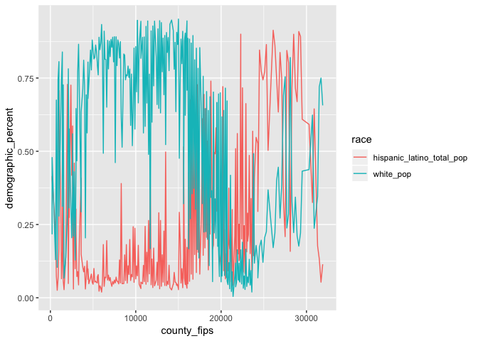<!-- -->

``` r
nyc_2000 %>% 
  filter(race == "hispanic_latino_total_pop" | race == "black_pop") %>% 
  ggplot(
    mapping = aes(x = county_fips, y = demographic_percent, color = race)
  ) +
  geom_line()
```

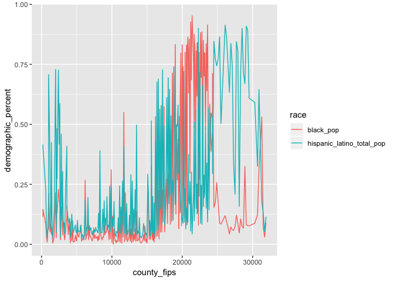<!-- -->

``` r
nyc_2000 %>% 
  filter(race == "white_pop") %>% 
  ggplot(mapping = aes(x = demographic_percent, y = median_household_income)) +
  geom_line()
```

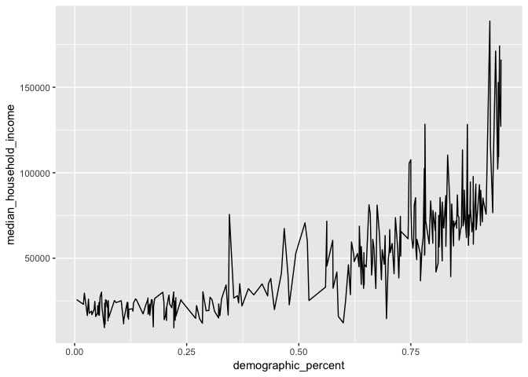<!-- -->

``` r
nyc_2000 %>% 
  filter(race == "black_pop") %>% 
  ggplot(mapping = aes(x = demographic_percent, y = median_household_income)) +
  geom_line()
```

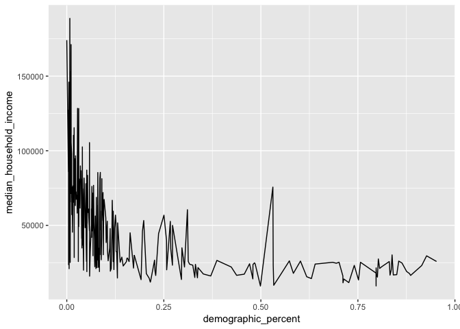<!-- -->

``` r
nyc_2000 %>% 
  filter(race == "asian_pop") %>% 
  ggplot(mapping = aes(x = demographic_percent, y = median_household_income)) +
  geom_line()
```

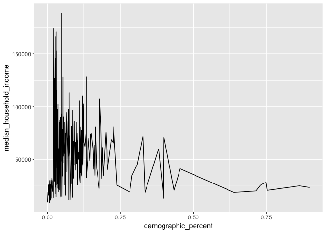<!-- -->

``` r
nyc_2000 %>% 
  filter(race == "hispanic_latino_total_pop") %>% 
  ggplot(mapping = aes(x = demographic_percent, y = median_household_income)) +
  geom_line()
```

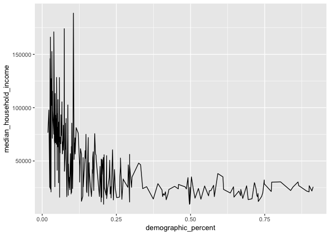<!-- -->

``` r
nyc_2000 %>% 
  filter(race == "native_pop") %>% 
  ggplot(mapping = aes(x = demographic_percent, y = median_household_income)) +
  geom_line()
```

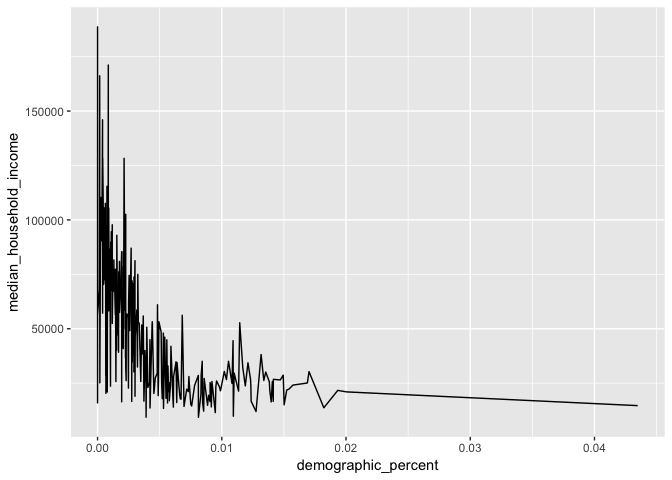<!-- -->

I want to try a little geospatial stuff out: (I have shapefiles from the
Census Bureau)

``` r
ny_census_tracts <-
  st_read(
    '~/Desktop/DCL/C01/gz_2010_36_140_00_500k/gz_2010_36_140_00_500k.shp'
  )
```

    ## Reading layer `gz_2010_36_140_00_500k' from data source `/Users/nataliegable/Desktop/DCL/C01/gz_2010_36_140_00_500k/gz_2010_36_140_00_500k.shp' using driver `ESRI Shapefile'
    ## Simple feature collection with 4911 features and 7 fields
    ## geometry type:  MULTIPOLYGON
    ## dimension:      XY
    ## bbox:           xmin: -79.76215 ymin: 40.4961 xmax: -71.85621 ymax: 45.01585
    ## epsg (SRID):    4269
    ## proj4string:    +proj=longlat +datum=NAD83 +no_defs

``` r
nyc_tracts <-
  nyc_2000 %>% 
  left_join(ny_census_tracts, by = c("full_tract_code" = "GEO_ID"))
```

    ## Warning: Column `full_tract_code`/`GEO_ID` joining character vector and
    ## factor, coercing into character vector

``` r
nyc_tracts %>% 
  filter(race == "white_pop") %>% 
  ggplot() +
  geom_sf(
    aes(fill = demographic_percent), 
    size = 0.01
  )
```

    ## Warning: Removed 25 rows containing non-finite values (stat_sf).

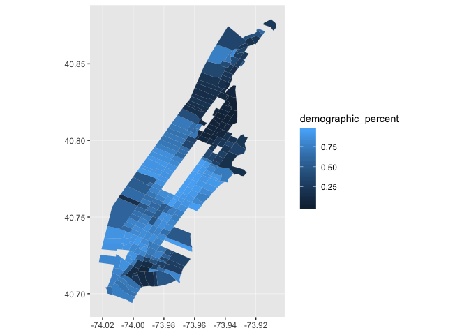<!-- -->

``` r
nyc_tracts %>% 
  ggplot() +
  geom_sf(
    aes(fill = median_household_income), 
    size = 0.01
  )
```

    ## Warning: Removed 200 rows containing non-finite values (stat_sf).

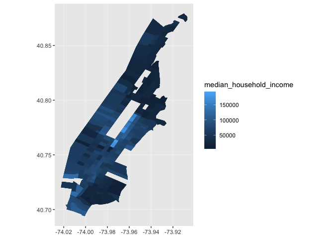<!-- -->

Now that I have some geospatial basics, maybe I’ll try to look at change
from 2000 to 2017\!

``` r
nyc_change <-
  nyc_2000 %>% 
  inner_join(nyc_2017, by = "county_fips") %>% 
  mutate(
    change_race = demographic_percent.x - demographic_percent.y,
    change_income = median_household_income.x - median_household_income.y
  ) %>% 
  select(
    full_tract_code = full_tract_code.x,
    race = race.x,
    change_race,
    change_income
  ) %>% 
  left_join(ny_census_tracts, by = c("full_tract_code" = "GEO_ID")) %>% 
  select(
    full_tract_code,
    race,
    change_race,
    change_income,
    geometry
  ) 
```

    ## Warning: Column `full_tract_code`/`GEO_ID` joining character vector and
    ## factor, coercing into character vector

``` r
nyc_change %>% 
  filter(race == "white_pop") %>% 
  ggplot() +
  geom_sf(
    mapping = aes(fill = change_race)
  ) +
  scale_fill_continuous(low = "blue", high = "red")
```

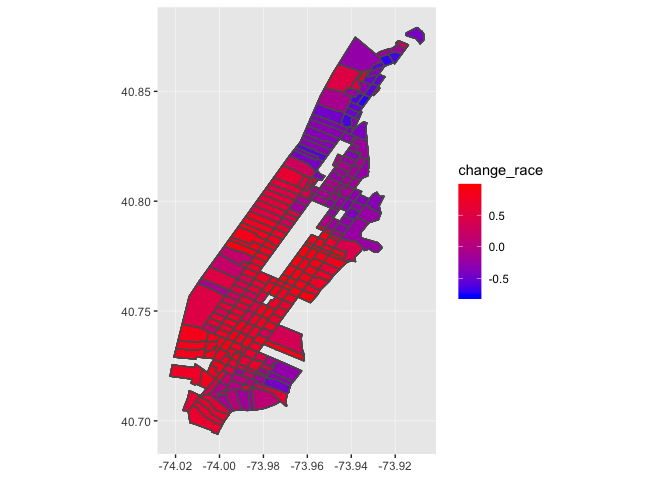<!-- -->

``` r
nyc_change %>% 
  filter(race == "black_pop") %>% 
  ggplot() +
  geom_sf(
    mapping = aes(fill = change_race)
  ) +
  scale_fill_continuous(low = "blue", high = "red")
```

<!-- -->

``` r
nyc_change %>% 
  filter(race == "hispanic_latino_total_pop") %>% 
  ggplot() +
  geom_sf(
    mapping = aes(fill = change_race)
  ) +
  scale_fill_continuous(low = "blue", high = "red")
```

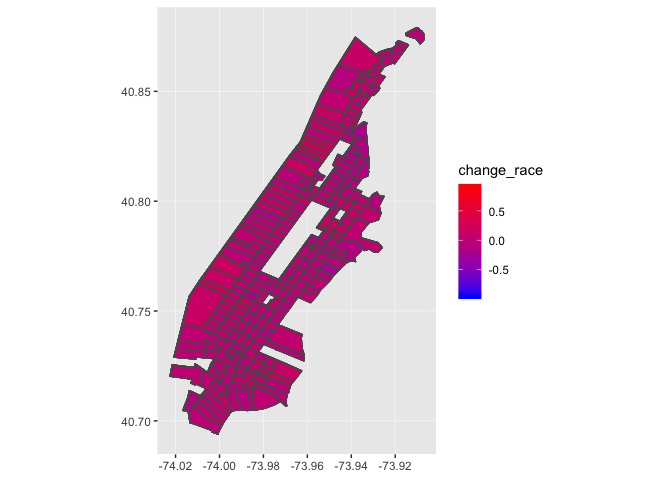<!-- -->

``` r
nyc_change %>% 
  ggplot() +
  geom_sf(
    mapping = aes(fill = change_income)
  ) +
  scale_fill_continuous(low = "blue", high = "red")
```

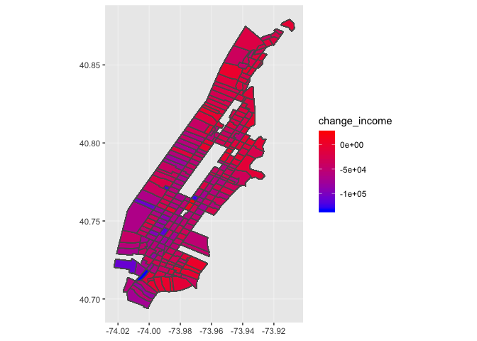<!-- -->

## Progress Report

Summary of progress: So far, I’ve found some good census data that I’ll
be using to track racial demographics and socioeconomic demographics
across the time span of 2000 to 2017. I’ll be using census data from
2000 and ACS data from 2017 to look at changes in demographics in New
York City tracts across the 17 year span. I have parsed and tidied the
data, to make it a bit more manageable. I also found some shapefiles
from the Census Bureau for all of NY state and ahve been working to
parse those too. I have also created a new dataframe which joins the
demographic data with the spatial mapping data and have been playing
around with mapping race and income levels across the years,
geospatially. In the study that I’m basing my work off, they have a
formal defintion of gentrification and I still need to work on
manipulating my data to mark whether a neighborhood has been formally
gentrified.

Key findings: Correlations between % white of a neighborhood and median
household income. The main thing I found was graph comparing the percent
of a neighborhood being white with a median household income. Across all
census tracts in NYC, there is an upward trend. I also learned a lot
about how to use .shp files, but I still need to work on specific
parsing issues related to that. I was able to successfully create some
maps of NYC with the different census tracts to show changes from 2000
to 2017 of both race and income.

Any issues: I think I’ll be able to figure out a lot of the
technicalities related to the census data but I’m having really hard
time working with the dataset I have on 311 calls. I found a super
awesome dataset but it has ~20 million rows and my computer is just
having a hard time dealing with the sheer scale of this dataset. I’m
trying to figure out a way that I can successfully work with these data
and not have my computer freak out\! (Would love any tips on this\!) My
current thoughts are to just take a segment of those data and work with
just that. The dataset contains all 311 calls make to the NYPD over the
past 9 years and is updated daily, so perhaps I can just take some data
from a few select years. I’m not sure though what would be best…like
should I edit the csv file?

Plans for next steps: \* Manipulate data to understand gentrification by
formal definition \* Make some prettier visualizations \* Zoom in on a
few neighborhoods \* Figure out the 311 call dataset\!\!
